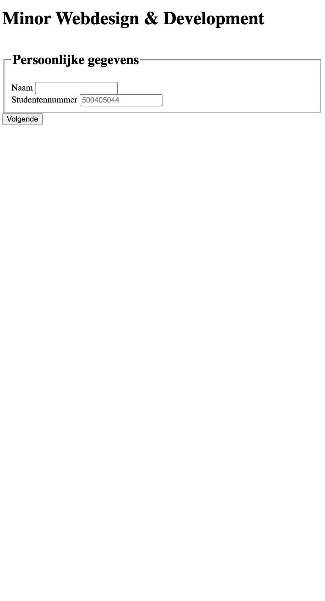
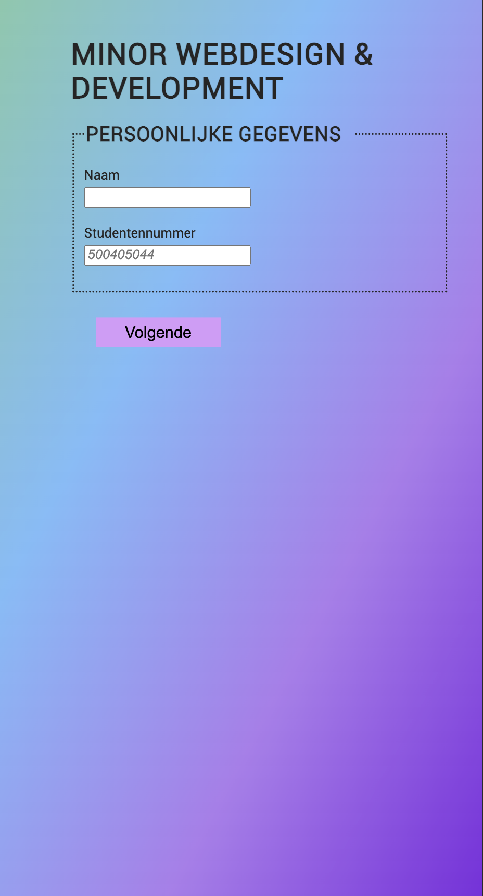
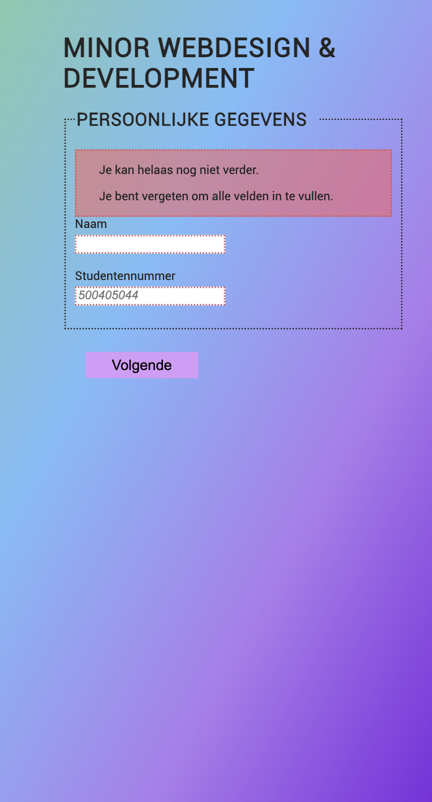
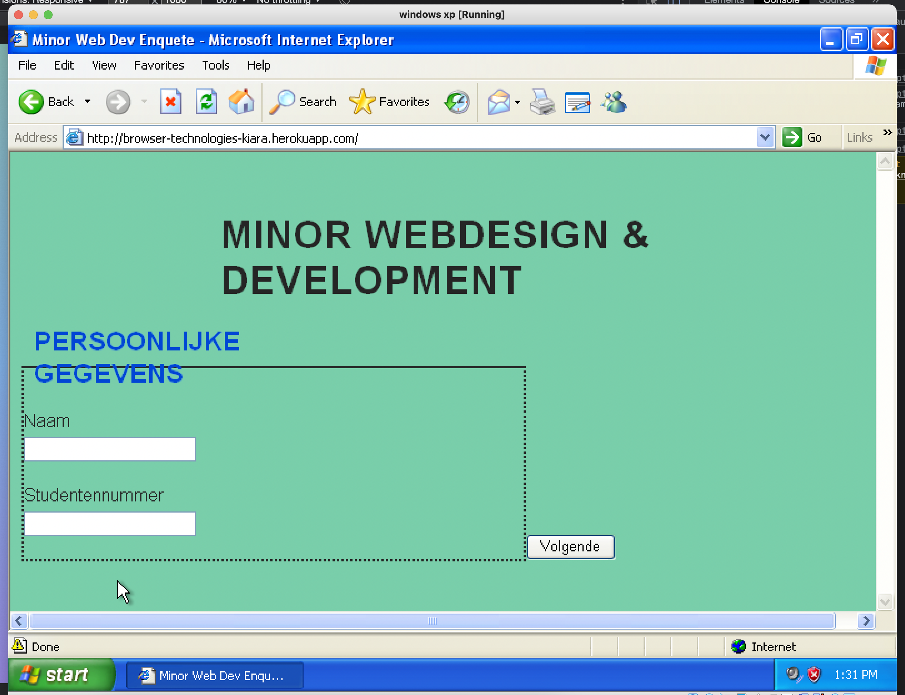

# Minor Webdesign & Webdevelopment Enquête
_Deze opdracht is gemaakt voor het vak Browser Technologies dat gegeven wordt tijdens de minor Webdesign & Webdevelopment aan de Hogeschool van Amsterdam_

## 🌐 Live demo
https://browser-technologies-kiara.herokuapp.com/

## Inhoudsopgave
* [Installatie](https://github.com/kiara1404/browser-technologies-2122#%EF%B8%8F-installatie)
* [Concept](https://github.com/kiara1404/browser-technologies-2122#concept)
* [Wireflow](https://github.com/kiara1404/browser-technologies-2122#-wireflow)
* [Features](https://github.com/kiara1404/browser-technologies-2122#features)
* [Progressive Enhancement](https://github.com/kiara1404/browser-technologies-2122#progressive-enhancement)
* [Browser Tests](https://github.com/kiara1404/browser-technologies-2122#browser-tests)
* [De opdracht](https://github.com/kiara1404/browser-technologies-2122#de-opdracht)
* [Rubric](https://github.com/kiara1404/browser-technologies-2122#rubric)
* [License](https://github.com/kiara1404/browser-technologies-2122#-license)


## ⚙️ Installatie
##### Clone this repo
```
git clone https://github.com/kiara1404/browser-technologies-2122
```
##### Install all packages
```
NPM install
```
##### Run application locally
```
nodemon run dev
```

## 📋Concept

## ↳ Wireflow
<!--  -->
## Features
* Invullen formulier
* Versturen formulier
* Gegevens moeten opgeslagen kunnen worden om later verder te gaan

## Progressive Enhancement
### Core Layer ( _HTML_ )

Ik ben begonnen met pure HTML. Dit om ervoor te zorgen dat de basis goed en bruikbaar zou zijn. Ik heb wel wat minder goede practices moeten toevoegen zodat de layout bij elke laag hetzelfde eruit zou zien.       
Normaal gesproken zijn `input` en `label` elementen inline. Ik wilde graag alles onder elkaar hebben dus heb ik er `div` elementen omheen gezet of soms zelfs stiekem een `br`

### Usable layer

Ik ben begonnen met het stylen van de pagina met de achtergrondkleur. Ik wilde een vrij neutrale kleur, dus koos ik voor een lichtgroen. Ik ben later wel overgegaan op een leuk gradient effect.

Ik heb zoveel mogelijk met CSS proberen op te lossen en visueel aantrekkelijk te maken.
* focus state
* valid state
* hovers
* goed onderscheid tussen checked en unchecked
* animation bij (re)load op de body

### Pleasurable layer

Voor deze laag wilde ik graag zorgen dat wanneer de gebruiker niet alle velden van het formulier heeft ingevuld, hier een melding over krijgt én dat de velden die nog leeg zijn, roodgekleurd worden. Zo kan je precies zien wat je nog moet invullen.

## 🧪Browser Tests
Ik heb mijn applicatie bekeken op verschillende devices.

* #### Google Chrome op  Macbook Pro 2019 
Ik gebruik Google Chrome als mijn standaardbrowser. Hierin werkte alles ook precies hoe ik het wilde. Ik heb ook gebruik gemaakt van de developer tools en toen werkte ook alles.
    * Font wordt ingeladen
    * Gradient werkt
    * focus/invalid/valid/placeholders selectoren werken
    * error melding werkt
    * required werkt 

* #### Firefox op Macbook Pro 2019
Op Firefox werkte mijn formulier ook naar behoren. Er viel hier niks op en had er geen aanmerkingen op.
    * Font wordt ingeladen
    * Gradient werkt
    * focus/invalid/valid/placeholders selectoren werken
    * error melding werkt
    * required werkt 

* #### Safari op iPhone 12 Pro Max
Op mijn mobiel zag bijna alles er hetzelfde uit als op desktop. Ik merkte alleen dat de breedte van de fieldsets iets breder waren dan het scherm, dus er zat een minimale horizontale scroll op die ik er niet in wilde hebben. 
    * Font wordt ingeladen
    * Gradient werkt
    * focus/invalid/valid/placeholders selectoren werken
    * error melding werkt
    * required werkt 

* #### Samsung internet op Samsung S7
De Samsung S7 komt volgens mij uit 2016 en doet het nog erg goed. Ik merkte dat ik de breedte van het formulier niet helemaal klopte. De radio buttons zaten niet meer op één regel. Alle functionaliteiten leken wel te werken.
    * Font wort ingeladen
    * Gradient werkt
    * focus/invalid/valid selectoren werken
    * error melding werkt
    * required werkt 

* #### Internet Explorer 6 op Windows XP Virtual Machine
Ik kon helaas door Corona niet op school testen met oude devices en niemand in mijn omgeving had een hele oude smartphone waarop ik mij applicatie kon testen. Dus ik heb een virtual machine aangemaakt op mijn laptop en daar laat ik Windows XP op draaien. Daar krijg je standaard Internet Explorer 6 bij.

Hier kwam ik pas achter hoe fijn wij het hebben met al onze nieuwe devices. Het formulier is wel bruikbaar, je kan het gewoon invullen en versturen. 
    * font wordt niet ingeladen
    * gradient werkt niet meer
    * Algehele styling is anders > knoppen niet gestyled en op verkeerde plek
    * required werkt niet meer
    * error melding werkt niet meer


## De opdracht
Voor de eindopdracht ontwerp en maak je een interactieve toepassing volgens het principe van Progressive Enhancement. Zorg dat alle gebruikers, met alle browsers, in iedere context de toepassing zo goed mogelijk te zien, horen en/of voelen krijgen. De meest 'enhanced' versie is 'delightful UX', mooi en prettig om te gebruiken.

### Doel van de opdracht
Het doel van deze opdracht is te leren hoe je een online interactieve toepassing kan maken met behulp van Progressive Enhancement en Feature Detection zodat die het altijd doet ...

### 🧠 Leerdoelen
* je leert wat Progressive enhancement is en hoe je dit kan toepassen.
* je leert Browser Technologies te onderzoeken, testen en implementeren als enhancement.
* je leert hoe je Feature Detection doet en wat je kan doen als een 'feature' niet werkt of wordt ondersteund.

### 🙋🏻‍♀️ User case
Ik wil een enquête kunnen invullen over de minor Web Development, met verschillende antwoordmogelijkheden. Als ik de enquête niet afkrijg, wil ik later weer verder gaan met waar ik ben gebleven.

### Vereisten voor de Enquete
* Studentgegevens (naam + nummer) verplicht

* Per vak
    * naam
    * docent(en)
    * weken waarin je het vak deed
    * beoordeling op schaal 1-10 van
    * lesstof (hoe moeilijk is het)
    * uitleg (hoe duidelijk is het uitgelegd)
    * eigen inzicht (hoe goed snap je het)
* Validatie: alles moet zijn ingevuld voordat je verder mag met het formulier. Geef duidelijke foutmeldingen.

* Als ik de enquete niet afkrijg, wil ik later weer verder gaan met waar ik ben gebleven.

## Rubric

## © License

